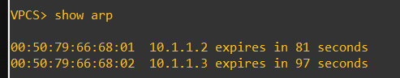
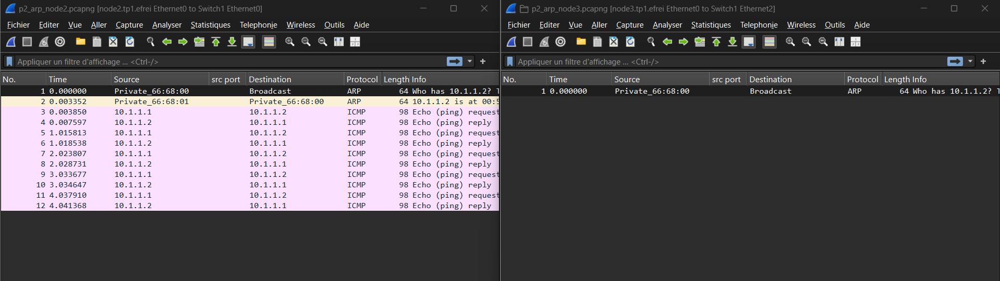
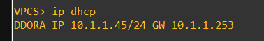

# TP1 : On r'voit les basics

# Part 1 - Most simplest LAN

## 3. Know your MAC


#### 🌞 Déterminer l'adresse MAC de vos deux machines


````
VPCS> show ip

MAC         : 00:50:79:66:68:00

MAC         : 00:50:79:66:68:01
````


## 4. IP Setup

#### 🌞 Définir une IP statique

````
VPCS1> ip 10.1.1.1/24

  

VPCS2> ip 10.1.1.2/24
````


#### 🌞 Proof !

````
VPCS1> show ip
IP/MASK     : 10.1.1.1/24

VPCS2> show ip
IP/MASK     : 10.1.1.2/24
````


#### 🌞 Effectuer un ping :

````
VPCS> ping 10.1.1.2

10.1.1.2 icmp_seq=1 ttl=64 time=0.001 ms
````


## 5. Analyze

#### 🌞 Protocolz ?

````
Le protocole utilisé est ICMP
````


# Part 2 : Bring that switch in
## 3. Même chose en fast

#### 🌞 Déterminer l'adresse MAC de vos trois machines

````
VPCS1> show ip 
MAC         : 00:50:79:66:68:00

VPCS2> show ip
MAC         : 00:50:79:66:68:01

VPCS3> show ip
MAC         : 00:50:79:66:68:02
````

#### 🌞 Définir une IP statique sur les trois machines

````
VPCS1> ip 10.1.1.1/24

VPCS2> ip 10.1.1.2/24

VPCS3> ip 10.1.1.3/24
````

#### 🌞Effectuer des ping d'une machine à l'autre

````
VPCS1> ping 10.1.1.2
84 bytes from 10.1.1.2 icmp_seq=1 ttl=64 time=4.801 ms

VPCS2> ping 10.1.1.3
84 bytes from 10.1.1.3 icmp_seq=1 ttl=64 time=7.358 ms

VPCS1> ping 10.1.1.3
84 bytes from 10.1.1.3 icmp_seq=1 ttl=64 time=9.044 ms
````

## 4. ARP old friend`

#### 🌞Afficher la table ARP de node1



# Part 3 : DHCP is a nice guy
## 3. Setuuuup

#### 🌞 Installer un serveur DHCP

````
-commande
sudo dnf install dnsmasq -y
sudo systemctl start dnsmasq
sudo systemctl enable dnsmasq


-contenu ajouté
interface=enp0s3
dhcp-range=10.1.1.10,10.1.1.50,255.255.255.0,12h
````

#### 🌞 Preuve Client :



